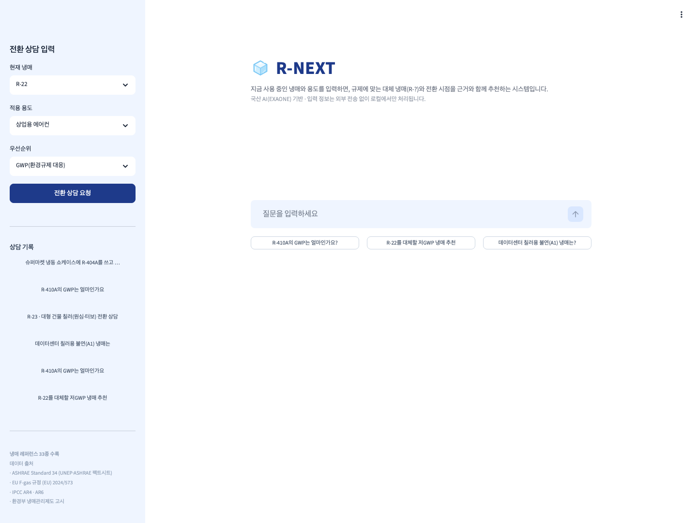
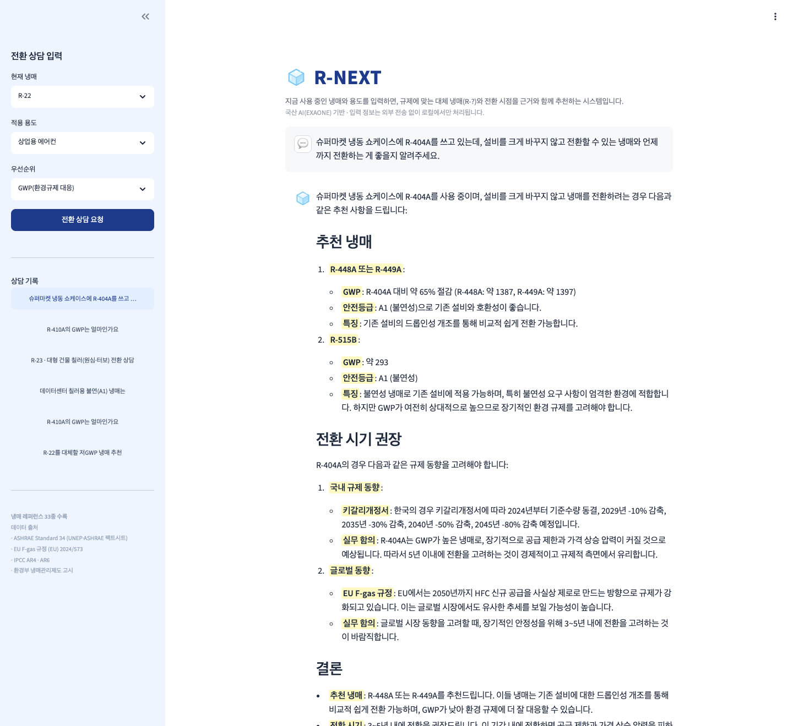
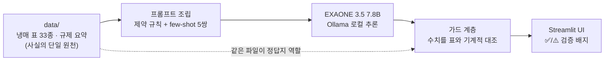

<div align="center">


# R-NEXT

**국산 AI 기반 냉매 전환 가이드** — 지금 냉매의 다음 답(R-?)을 규제 근거와 함께


2026년 리부트AI활용대회 산출물 · 입력 정보는 외부 전송 없이 로컬에서만 처리됩니다

</div>

---

## 한눈에 보기

| 첫 화면 | 상담 답변 (구조화 + 형광펜 강조 + 검증 배지) |
|---|---|
|  |  |

현재 냉매·용도·우선순위를 넣으면, 저GWP 대체 냉매를 **GWP 비교 / 안전등급 / 전환 고려사항 / 규제 시점**과 함께 추천합니다. 답변 아래의 ✅ 배지는 장식이 아니라 — 답변 속 모든 수치를 레퍼런스 표와 기계적으로 대조한 **실시간 검증 결과**입니다.

## 왜 만들었나

- AI 데이터센터 확산으로 랙당 전력밀도가 기존 5–15kW에서 50–130kW 수준으로 급증하며 **냉각이 AI 인프라의 병목**이 됐고, 냉각 전환은 곧 "어떤 냉매를 쓸 것인가"의 문제가 됐습니다.
- 키갈리개정서(한국: 2024 동결 → 2045 −80%), HCFC 퇴출, EU F-gas, PFAS 논의까지 **규제가 전환을 강제**하는데, 잘못된 냉매 선택은 수천억 원대 설비의 재전환 비용으로 돌아옵니다.
- 그런데 판단에 필요한 정보(GWP·안전등급·감축 일정·대체냉매)는 국제협약·환경부 고시·제조사 자료에 **흩어져 있습니다**. 현장 실무자를 위한 통합 의사결정 도구가 없다는 것이 이 프로젝트의 출발점입니다.

국산 모델·로컬 실행을 택한 이유: 한국어 규제 문서의 특수성, 사업장 설비 정보의 민감성(외부 API 미전송), 그리고 주권 AI 흐름과의 정합성.

## 어떻게 동작하나



**설계 원리 — 사실은 데이터에서, 언어는 모델에서, 검증은 가드에서.** 소형 모델은 수치를 그럴듯하게 지어내므로, 모델의 내부 지식에 의존하지 않고 3중 장치로 환각을 통제합니다:

1. **전표 주입 그라운딩** — 냉매 33종의 속성 표 전체를 컨텍스트에 직접 넣습니다 (수 KB라 RAG의 검색 실패 리스크 자체가 없음)
2. **거절 few-shot** — "표에 없으면 모른다고 답한 전례"를 대화 턴으로 주입해 표 밖 질문에 대한 거절을 학습시킵니다
3. **결정론적 가드** — 답변 속 GWP·안전등급을 표와 자동 대조하고, 표에 없는 냉매·속성(임계온도 등) 답변을 감지해 UI에 경고합니다. 같은 JSON이 프롬프트(참고서)와 가드(정답지)를 겸하므로 둘이 어긋날 수 없습니다.

## 실측 검증

자체 평가셋 16문항(사실 6 · 추천 5 · 규제 2 · **환각 트랩 3**)으로 측정했습니다:

| 지표 | 결과 |
|---|---|
| 그라운딩 정확도 | **84.6%** (11/13) |
| 환각률 | **12.5%** |
| 트랩 거절 | 1/3 → **2/3** (거절 few-shot 보강 후) |
| 16문항 소요 | 319초 (MacBook M3 Pro, 로컬) |

- 트랩 문항: 존재하지 않는 냉매(R-999), 표에 없는 냉매(R-466A), 표에 없는 속성(임계온도) — 수치를 지어내면 환각으로 판정
- 채점기 자체도 회귀 테스트 18건으로 검증했고, 채점 로직 수정 시 모델 재실행 없이 재채점하는 도구(`eval/regrade.py`)를 갖췄습니다
- 재현: `python3 eval/run_eval.py` 한 줄 (결과는 `eval/results/`에 저장)

개발 과정에서 발견해 고친 대표 결함: Ollama 기본 4096 컨텍스트에 9K 토큰 프롬프트가 **조용히 잘려 그라운딩이 무력화**되던 문제 — 16K 명시 + 초과 시 에러를 내는 방어 코드로 해결. 상세한 과정은 커밋 히스토리에 있습니다.

## 데이터 — 전량 직접 큐레이션

| 자료 | 규모 | 근거 출처 |
|---|---|---|
| 냉매 속성 표 (`data/reference/refrigerants.json`) | 33종 | [UNEP×ASHRAE 팩트시트](https://ozone.unep.org/system/files/documents/UPDATED-Factsheet_ASHRAE_English_20180625_printer-11X17.pdf), [EU F-gas (EU) 2024/573](https://eur-lex.europa.eu/eli/reg/2024/573/oj/eng), IPCC AR4·AR6 |
| 규제 요약 (`data/reference/regulations_summary.md`) | 6개 절 | 몬트리올·키갈리, [환경부 냉매관리기준 고시](https://law.go.kr/LSW/admRulLsInfoP.do?admRulSeq=2100000265378), PFAS 동향 |
| few-shot 골드 예시 | 5쌍 (거절 예시 2종 포함) | 직접 작성 |
| 평가셋 | 16문항 | 직접 작성 |

GWP는 규제(키갈리·EU Annex I)와 정합한 **AR4 기준을 기본**으로 하고 항목마다 기준을 명시했습니다. 모든 수치에 출처 키가 붙어 있으며, 교차검증 미완 항목은 `needs_verification` 플래그로 표시되어 답변에 자동으로 단서가 달립니다.

## 빠른 시작

```bash
# 1. 모델 준비 (최초 1회, 약 5GB)
brew install ollama && ollama serve   # 별도 터미널
ollama pull exaone3.5:7.8b

# 2. 앱 실행
pip install -r requirements.txt
streamlit run app/ui.py

# 3. 평가 재현
python3 eval/run_eval.py
```

## 프로젝트 구조

```
├── data/            # 그라운딩 데이터 — 냉매 표·규제 요약·few-shot·평가셋 (+출처 기록)
├── app/
│   ├── loader.py    # data/ 로딩·직렬화 (사실의 단일 원천)
│   ├── prompt.py    # 제약 시스템 프롬프트 + few-shot 대화 턴 조립
│   ├── llm.py       # Ollama 네이티브 클라이언트 (16K 컨텍스트 명시·잘림 방어)
│   ├── guard.py     # 결정론적 환각 검증 (수치 대조·거절 감지·표외 속성 경고)
│   ├── advisor.py   # 파이프라인 진입점 (UI·평가 공용)
│   └── ui.py        # Streamlit 챗 UI (상담 기록·검증 배지)
└── eval/            # 평가 하네스 + 재채점 도구 + 결과
```

## 한계와 로드맵

- 냉매 표 5종의 통용값 교차검증 완료, 규제 세부 일정의 원문 대조가 남아 있습니다 (데이터에 플래그로 관리 중)
- 확장 계획: 규제 원문 RAG(한국어 임베딩 + ChromaDB)로 근거 문서 인용, 상대 비용 지표 추가, 데이터센터 냉각액(액침 유체) 도메인 확장

> **라이선스 유의**: EXAONE 3.5 모델은 비상업(NC) 라이선스입니다. 본 저장소는 교육·연구 목적의 코드이며, 모델 가중치는 포함하지 않습니다(각자 `ollama pull`로 수령).
